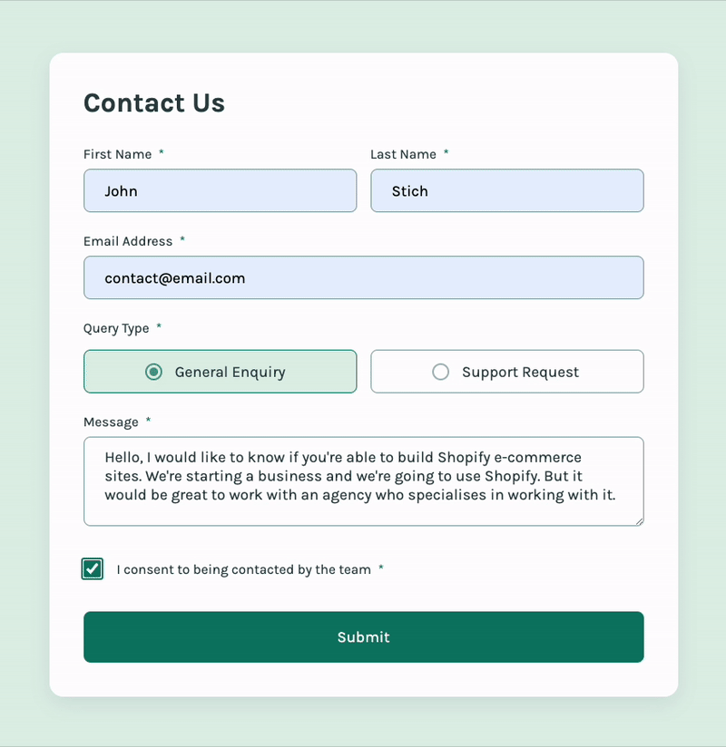

# Contact form solution

This is a solution to the [Contact form challenge on Frontend Mentor](https://www.frontendmentor.io/challenges/contact-form--G-hYlqKJj). It is a responsive contact form built using modern web technologies. The form handles errors, data processing, and user feedback effectively.



The project is live at: [https://ionstici.dev/contact-form-fem/](https://ionstici.dev/contact-form-fem/) & [Frontend Mentor Solution](https://www.frontendmentor.io/solutions/contact-form-GnTWf8kFK0)

## Built With

- `react` : library for building user interfaces
- `react-hook-form` : library for validating and managing from data in React
- `react-hot-toast` : library for displaying notifications
- `styled-components` : library for styling React components using tagged template literals
- `vite` : modern build tool
- `gh-pages` : package for publishing projects on GitHub Pages

## Features

- **Data Processing** : Processes the form data upon submission
- **Form Validation** : Ensures that all required fields are filled out and that the email address is valid
- **Error Handling** : Provides feedback to users if they submit the form with invalid or incomplete data
- **User Feedback** : Displays success messages using `react-hot-toast`

## Installation

To run this project locally, follow these steps:

```bash
git clone https://github.com/ionStici/contact-form-fem
cd contact-form-fem
npm install
npm run dev
```

## Contributing

Contributions are welcome! If you have any ideas, suggestions, or issues, please feel free to create a pull request or open an issue. Please refer to [CONTRIBUTING.md](./CONTRIBUTING.md) for guidelines on how to proceed.

## License

This project is licensed under the MIT License. See [LICENSE](./LICENSE) file for more information.

## Acknowledgments

- Frontend Mentor for providing the challenge.
- The React community for their valuable resources and libraries.

## Contact

- [ionStici | GitHub](https://github.com/ionStici)
- [Ion Stici | LinkedIn](https://www.linkedin.com/in/ionstici/)

Feel free to reach out if you have any questions or suggestions!
